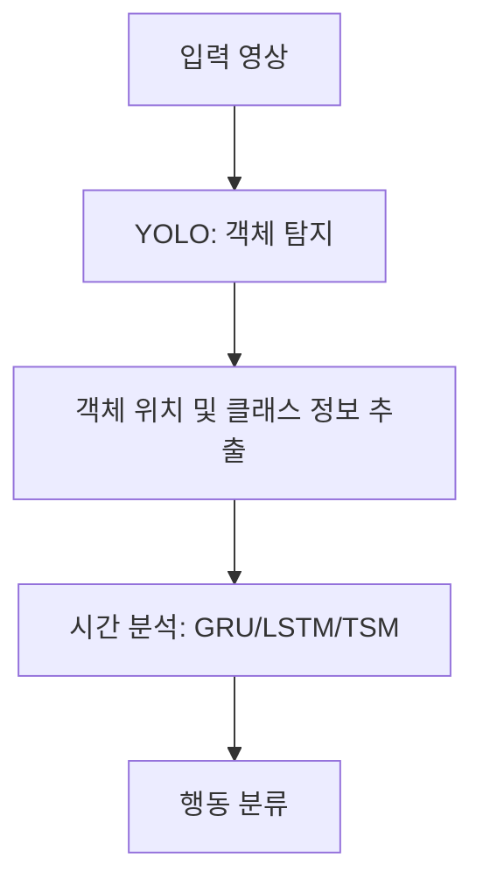

# 범죄 탐지 소형 로봇 (TransBot-Anomaly-Tracker)
주택단지 실시간 모니터링을 위한 범죄 탐지 소형 로봇 프로젝트입니다. 본 프로젝트는 AI와 로봇 기술을 활용하여 
실시간 범죄 행동을 탐지하고, 이를 바탕으로 안전한 주거 환경을 제공합니다.

## 프로젝트 배경 및 목적
- **배경**:
  경찰 미래비전 2050에서는 AI와 로봇 기술을 활용한 첨단 치안 활동을 목표로 하고 있습니다. 그러나 기존의 드론 및 4족 보행 로봇은 
  높은 비용, 개인정보 침해, 안전 문제와 같은 한계가 존재합니다.
- **목적**:
  소형 4륜 구동 로봇을 사용하여 보다 효율적이고 안전한 순찰 지원 및 범죄 예방 활동을 목표로 합니다. 이를 통해 CCTV 사각지대와 
  접근이 어려운 구역에서의 범죄 탐지를 지원하고, 경찰의 업무 부담을 줄이는 데 기여합니다.

## 주요 기능
1. **모바일 로봇의 지정 경로 순찰**:
   ROS와 라이다 기술을 활용하여 자율적으로 지정된 구역을 순찰.
2. **범죄 행동 탐지 및 대응**:
   OpenCV, YOLO, CNN 등을 사용하여 실시간으로 이상 행동을 탐지하고 경고 대응.
3. **범죄 상황 요약**:
   LLM(대규모 언어 모델)을 활용해 상황을 요약하고 보고서 작성.

#### 5. **기술 스택**
## 기술 스택
- **Python**: 데이터 처리 및 AI 모델 구현.
- **TensorFlow & PyTorch**: 딥러닝 기반 모델 학습 및 추론.
- **ROS (Robot Operating System)**: 로봇 자율 주행 및 경로 탐색.
- **OpenCV & YOLO**: 이미지 처리 및 객체 탐지.
- **LLM & RAG**: 생성형 AI 기반 요약 및 상황 기록.

---
# 트랜스 봇(H/W)

---

# AI 모델(S/W)
## 프로젝트 배경 및 모델 선정 과정
1. **객체 탐지**: 실시간으로 보행자, 차량, 기타 객체를 탐지합니다.
2. **행동 분석**: 시간 기반 행동 패턴을 분석하여 이상 행동을 탐지합니다.
3. **효율성**: Jetson Nano와 같은 경량 하드웨어 환경에서도 실행 가능한 시스템을 구축합니다.

## 모델 선정

### 1. **초기 프로젝트 목표**
시스템 설계 초기에는 다음과 같은 목표를 설정했습니다:
- 실시간 객체 탐지와 분류 수행.
- 시간 기반 행동 패턴을 분석해 이상 행동을 탐지.
- 경량 디바이스에서도 효율적으로 동작.

### 2. **모델 선정 기준**
모델을 선정할 때 다음 조건을 고려했습니다:
- **실시간성**: 시간 지연 없이 즉각적으로 처리 가능.
- **정확성**: 높은 탐지 및 분류 정확도.
- **경량성**: Jetson Nano와 같은 제한된 자원 환경에서 실행 가능.
- **시간 분석**: 시간 기반 행동을 효과적으로 분석 가능.

### 3. **초기 검토된 모델**
| **모델 조합**         | **장점**                                       | **단점**                                          |
|-----------------------|-----------------------------------------------|--------------------------------------------------|
| EfficientNet + GRU    | 높은 특징 추출 정확도                          | 높은 계산 비용, 실시간 처리 속도 부족              |
| MobileNet + LSTM      | 경량화된 특징 추출                             | 직접적인 객체 탐지 불가, 추가 알고리즘 필요         |
| 3D CNN + GRU          | 시간-공간 분석 결합                            | 높은 계산량, Jetson Nano 환경에서 비효율적          |

### 4. **최종 모델 선정**
위 옵션들의 한계를 검토한 후, 다음 모델을 최종 선정했습니다:

| **기능**         | **최초 검토된 모델**              |        **최종 선정된 모델**                   | **이유**                                          |
|-----------------------|------------------------------- | ----------------|--------------------------------------------------|
| 객체 탐지              | EfficientNet, MobileNet, 3D CNN   |     YOLO (Tiny 버전)        | 실시간 객체 탐지 성능과 경량화된 구조, Jetson Nano에서 실시간 처리 가능.  |
| MobileNet + LSTM      | GRU, LSTM, TSM                   |     GRU, LSTM, TSM       | 시간적 패턴 분석 기능, 상황에 맞는 유연한 조합 사용 가능.         |
| 3D CNN + GRU          | EfficientNet, MobileNet                   |  YOLO (내장된 CNN 기능)         | YOLO (내장된 CNN 기능)         |

- **YOLO (Tiny 버전)**: 실시간 객체 탐지와 특징 추출을 동시에 수행.
- **GRU/LSTM/TSM**: 시간적 패턴 분석 및 행동 분류.

## 최종 모델 구성

### 1. **YOLO**
- **역할**: 각 프레임에서 객체 탐지 및 특징 추출.
- **선정 이유**:
  - 객체 탐지와 특징 추출을 결합한 효율적인 구조.
  - 경량화된 버전(YOLOv4-Tiny, YOLOv8-Nano)으로 Jetson Nano에서도 실시간 동작 가능.

### 2. **GRU**
- **역할**: 단기 시간적 패턴 분석.
- **선정 이유**:
  - LSTM에 비해 경량화되어 있음.
  - 짧은 시간 간격의 행동 변화를 효과적으로 학습.

### 3. **LSTM**
- **역할**: 장기 시간 의존성 분석.
- **선정 이유**:
  - 복잡한 반복 행동 패턴 분석에 적합.

### 4. **TSM**
- **역할**: 경량화된 시간 분석.
- **선정 이유**:
  - 추가 파라미터 없이 실시간 시스템에서 시간적 정보를 효율적으로 학습 가능.

### 워크플로우

## 전처리 상세 과정

### 1. 데이터 분리 및 정리
- **목적**: 구글 드라이브에 업로드된 학습 데이터 준비를 위한 구조 정리.
- **작업 내용**:
  - 비디오(mp4)와 라벨(XML) 파일 매칭 및 불필요한 파일 제거.
  - 파일 이름을 행동 유형에 따라 일괄 변경하고, 지정된 폴더로 이동.

 
- **구현 코드**:
  - `rename_and_move_files_with_matching()` 함수:
    - 예: `assault_001`, `assault_002` 형식으로 이름 변경 후 `video/`, `label/` 폴더로 정리.

### 2. 라벨 데이터 기반 구간 추출
- **목적**: 폭행 및 이상 행동이 발생한 특정 시간 구간만 추출.
- **작업 내용**:
  - 라벨 파일에서 시작 시간(starttime)과 지속 시간(duration)을 초 단위로 변환.
  - 해당 구간을 프레임 단위로 계산하여 비디오 클립으로 추출.
  
- **구현 코드**:
  - `extract_action_frames_from_event()`: 행동 구간 추출.
  - `save_action_clips()`: 지정 구간을 비디오 클립으로 저장.

### 3. ROI(Region of Interest) 추출
- **목적**: 객체 탐지를 통해 ROI 설정 및 불필요한 정보 제거.
- **작업 내용**:
  - YOLO를 사용하여 'person' 객체 탐지.
  - 여러 프레임에서 탐지된 바운딩 박스를 누적하여 최종 ROI 설정.
  - ROI 영역만 추출한 비디오로 저장.
- **구현 코드**:
  - YOLO를 사용하여 `confidence_threshold` 기반 탐지.
  - 누적 좌표(`min_x, min_y, max_x, max_y`)로 ROI 설정.

### 4. 전처리 방식
#### **1-1 미디어파이프 기반 파이프라인 생성**
- **목적**: 행동 패턴 추출을 위한 포즈 데이터 생성.
- **작업 내용**:
  - YOLO로 탐지된 객체별 MediaPipe로 자세 데이터 생성.
  - 행동 이벤트 구간에서 포즈 데이터를 시각화 및 저장.

#### **2-2 엣지 검출 기반 방식**
- **목적**: 주요 구조적 특징 강조.
- **작업 내용**:
  - Gaussian Blur, Median Filter 등으로 노이즈 제거.
  - Canny Edge Detection으로 윤곽선 강조 후 데이터 저장.

