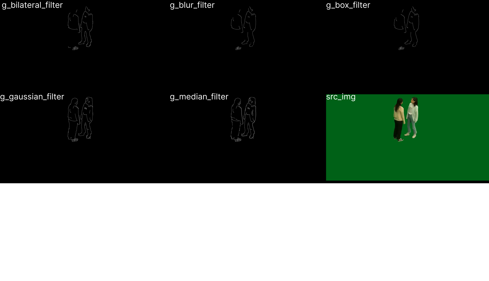

# 범죄 탐지 소형 로봇 (TransBot-Anomaly-Tracker)

CCTV 사각지대를 보완하고, 실시간 범죄 탐지로 주거 환경을 안전하게 만드는 소형 로봇 프로젝트입니다.

## 목차
- [범죄 탐지 소형 로봇 (TransBot-Anomaly-Tracker)](#범죄-탐지-소형-로봇-transbot-anomaly-tracker)
- [프로젝트 배경 및 목적](#프로젝트-배경-및-목적)
- [주요 기능](#주요-기능)
- [기술 스택](#기술-스택)
- [AI 모델 구성](#ai-모델sw)
- [데이터 전처리](#전처리-상세-과정)

## **프로젝트 배경 및 목적**  

### **1. 배경**  
기존의 드론 및 4족 보행 로봇은 **높은 비용**, **개인정보 침해**, **안전 문제** 등으로 인해 주거지에서 적용하기 어렵습니다.  
이를 해결하기 위해 AI와 로봇 기술을 결합한 **효율적이고 경제적인 치안 로봇**을 개발하고자 합니다.  

### **2. 목적**  
- **CCTV 사각지대 커버**: 기존 감시 시스템이 닿지 않는 구역까지 실시간 순찰.  
- **범죄 예방**: AI로 이상 행동을 탐지해 즉각 대응 가능.  
- **업무 효율화**: 자율 순찰과 데이터 자동 보고로 경찰 업무 부담 감소.  

## **주요 기능**  
1. **자율 경로 순찰**: 라이다와 ROS를 활용해 지정된 구역을 스스로 순찰.  
2. **범죄 행동 탐지**: OpenCV와 YOLO를 통해 이상 행동 실시간 감지 및 경고.  
3. **상황 요약 보고**: AI 기반으로 탐지된 상황을 요약해 자동 보고서 생성.  

## **기술 스택**
- **프로그래밍 언어**: Python (주요 구현 언어)  
- **AI 모델**: TensorFlow, PyTorch (딥러닝 라이브러리), YOLO (객체 탐지)  
- **로봇 플랫폼**: ROS (자율 주행), 라이다 센서 (지도 작성 및 경로 탐색)  
- **영상 및 데이터 처리**: OpenCV (영상 처리), MediaPipe (포즈 데이터 생성)  
- **하드웨어 플랫폼**: Jetson Nano (AI 연산 및 경량화 환경)  
- **추가 도구**: NumPy, Pandas (데이터 처리 및 분석)  

---
# 트랜스 봇(H/W)

## Jetson nano <-> Ubuntu 통신
Jetson nano에서 Visualization tool을 사용하기 어렵기 때문에 Laptop과 연결하여 사용

1. **Linux 연결**: Ubuntu 18.04가 LAN을 인식하지 못함 -> Window를 통해 VMWare로 접속
2. **Jeton 연결**: Window를 통해 VNC로 접속

## 통신 및 제어:
하나의 PC를 통해 Mapping하는 모습

1. **좌측 사진**: PC화면
2. **우측 사진**: 동작모습

## 로봇 미들웨어(M/W)
하드웨어와 애플리케이션 소프트웨어 사이에서 동작하며, 서로 상호작용할 수 있도록 데이터 전달과 관리 기능을 제공

1. **OS 통신**: ROS를 통해 Master(Jetpack)-Slave(Linux) 통신
2. **어플리케이션**:
   - SLAM: Localization, Mapping
   - Rviz: Visualization
3. **ROS Packages**:
   - Bring-up packages: Lidar, Camera, Motor 등의 H/W를 동작하는 ROS node의 package
   - Navigation packages: 장애물 회피, Mapping, Navigation 등의 ROS node의 package

## 트랜스 봇 동작 모습
Mapping 이후 Goal position을 입력하면 해당 위치로 이동하는 모습

## H/W 추후 계획
1. **mapping algorithm 학습**
   - Gmapping, hector 등
2. **트랜스 봇의 상세한 동작 시나리오 작성**
3. **Package customizing**
   - bring-up, navigation 등 transbot package에서 필요한 기능만 모아서 repackaging
   - 완료 후, ROS package 수정

---

# **AI 모델(S/W)**

## **프로젝트 배경 및 모델 선정 과정**
### **1. 주요 목표**
- **객체 탐지**: 실시간으로 보행자, 차량 등 객체를 탐지.  
- **행동 분석**: 시간 기반 행동 패턴 분석을 통해 이상 행동 감지.  
- **효율성**: Jetson Nano와 같은 경량 하드웨어에서도 동작 가능한 시스템 설계.

---

## **모델 선정 과정**
### **1. 초기 목표**
- 실시간 객체 탐지와 분류.  
- 시간 기반 행동 패턴 분석.  
- 제한된 하드웨어 자원에서 효율적인 동작.  

### **2. 모델 선정 기준**
- **실시간성**: 시간 지연 없이 빠르게 처리 가능해야 함.  
- **정확성**: 객체 탐지와 이상 행동 분류 정확도 확보.  
- **경량성**: Jetson Nano 등 제한된 자원에서도 원활히 실행.  
- **시간 분석**: 행동의 시간적 흐름을 효과적으로 분석 가능해야 함.  

---

### 3. **초기 검토된 모델**
| **모델 조합**         | **장점**                                       | **단점**                                          |
|-----------------------|-----------------------------------------------|--------------------------------------------------|
| EfficientNet + GRU    | 높은 특징 추출 정확도                          | 높은 계산 비용, 실시간 처리 속도 부족              |
| MobileNet + LSTM      | 경량화된 특징 추출                             | 직접적인 객체 탐지 불가, 추가 알고리즘 필요         |
| 3D CNN + GRU          | 시간-공간 분석 결합                            | 높은 계산량, Jetson Nano 환경에서 비효율적          |

---

### 4. **최종 모델 선정**
위 옵션들의 한계를 검토한 후, 다음 모델을 최종 선정했습니다:

| **기능**         | **최초 검토된 모델**              |        **최종 선정된 모델**                   | **이유**                                          |
|-----------------------|------------------------------- | ----------------|--------------------------------------------------|
| 객체 탐지              | EfficientNet, MobileNet, 3D CNN   |     YOLO (Tiny 버전)        | 실시간 객체 탐지 성능과 경량화된 구조, Jetson Nano에서 실시간 처리 가능.  |
| backbone 모델(YOLO 미사용시)| GRU, LSTM, TSM                   |     GRU, LSTM, TSM       | 시간적 패턴 분석 기능, 상황에 맞는 유연한 조합 사용 가능.         |
| 시계열 분석 모델          | EfficientNet, MobileNet                   |  YOLO (내장된 CNN 기능)         | YOLO (내장된 CNN 기능)         |

---

## 최종 모델 구성

### 1. **YOLO(Tiny 버전)**
- **역할**: 실시간 객체 탐지 및 특징 추출.
- **선정 이유**:
  - 경량화된 구조로 Jetson Nano에서도 실시간 처리 가능.  
  - 높은 탐지 정확도와 효율적인 연산 제공.

### 2. **GRU**
- **역할**: 단기 시간적 패턴 분석.
- **선정 이유**:
  - LSTM보다 경량화되어 단기 행동 변화를 효율적으로 학습.

### 3. **LSTM**
- **역할**: 장기 시간 의존성 분석.
- **선정 이유**:
  - 복잡한 반복 행동 패턴 분석에 적합.

### 4. **TSM**
- **역할**: 경량화된 시간 분석.
- **선정 이유**:
  - 추가 파라미터 없이 실시간 시스템에서 시간적 정보를 효율적으로 학습 가능.
    
---

### **선정 이유 요약**
1. **YOLO (Tiny 버전)**: 실시간 객체 탐지와 특징 추출 가능.  
2. **GRU / LSTM / TSM**: 시간적 행동 분석에 유연한 조합.  

---

## **모델 동작 워크플로우**

## 전처리 상세 과정

### 1. 데이터 분리 및 정리
- **목적**: 구글 드라이브에 업로드된 학습 데이터 준비를 위한 구조 정리.
- **작업 내용**:
  - 비디오(mp4)와 라벨(XML) 파일 매칭.
  - 불필요한 파일 제거 및 행동 유형별로 이름 변경 후 정리.
 
- **구현 코드**:
  - `rename_and_move_files_with_matching()` 함수:
    - 예: `assault_001`, `assault_002` 형식으로 이름 변경 후 `video/`, `label/` 폴더로 정리.

---

### 2. 라벨 데이터 기반 구간 추출
- **목적**: 폭행 및 이상 행동이 발생한 특정 시간 구간만 추출.
- **작업 내용**:
  - 라벨 파일에서 시작 시간(starttime)과 지속 시간(duration)을 초 단위로 변환.
  - 해당 구간을 프레임 단위로 계산하여 비디오 클립으로 추출.
  
- **구현 코드**:
  - `extract_action_frames_from_event()`: 행동 구간 추출.
  - `save_action_clips()`: 지정 구간을 비디오 클립으로 저장.

---

### 3. ROI(Region of Interest) 추출
- **목적**: 객체 탐지를 통해 ROI 설정 및 불필요한 정보 제거.
- **작업 내용**:
  - YOLO를 사용하여 'person' 객체 탐지.
  - 여러 프레임에서 탐지된 바운딩 박스를 누적하여 최종 ROI 설정.
  - ROI 영역만 추출한 비디오로 저장.
 
 
- **구현 코드**:
  - YOLO를 사용하여 `confidence_threshold` 기반 탐지.
  - 누적 좌표(`min_x, min_y, max_x, max_y`)로 ROI 설정.

  ---

### 4. 전처리 방식
#### **4-1 미디어파이프 기반 파이프라인 생성**
- **목적**: 포즈 데이터를 생성하여 행동 패턴을 분석.
- **작업 내용**:
  - YOLO로 탐지된 객체별 MediaPipe로 자세 데이터 생성.
  - 행동 이벤트 구간에서 포즈 데이터를 시각화 및 저장.
- **작업 과정 및 문제 해결**
  - MediaPipe Pose 적용
    

  - BlazePose 적용
    
 

#### **4-2 엣지 검출 기반 방식**
- **목적**: 모델 경량화와 사람 외관의 구조적 특징 강조하여 분석 효과 향상.
- **작업 내용**:
  - 사용하는 데이터셋은 실내 크로마키 영상과 야외 촬영 영상 2가지로 각각 저처리를 진행.
  - 크로마키 영상 경우 별도의 배경 없이 사람의 윤곽선만 검출.
  - 야외 영상 경우 별도로 배경 제거 하지않고 진행.
  - Gaussian Blur, Median Filter 등으로 노이즈 제거.
  - Canny Edge Detection으로 윤곽선을 추출하고 저장.
- **작업 과정 및 문제해결**
  - 이미지 필터링 후 윤곽선 검출 테스트 결과

  - 영상 배경 제거 및 필터링 후 윤곽선 검출 테스트 결과

  - 최종 결과: 배경 제거 후 median 필터를 적용한 전처리 방식 선정 

### 5. 추후 계획
#### **5-1 미디어파이프 기반 파이프라인 생성**
  - blaze pose: 
    
  - YOLOv7 & YOLOv8 모델 Jetson Nano적용 테스트: 기존의 MediaPipe, blaze pose과 같은 모델과 달리 1stage로 KeyPoint 추출 가능

#### **5-2 엣지 검출 기반 방식**
  - 정상 행동 데이터 엣지 검출 작업 
  - LSTM, GRU, TSM 모델 학습

  ---

